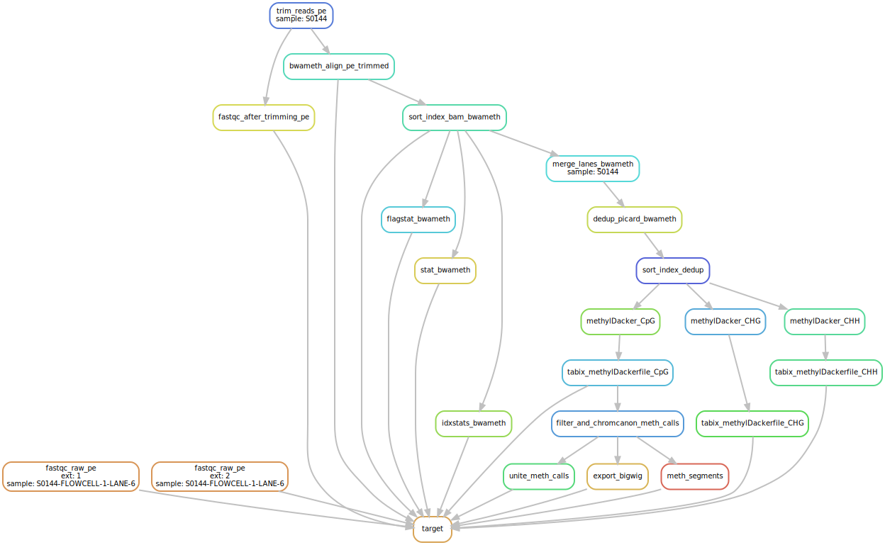

This is a private repository that contains a pipeline for WGBS data analysis. 

## What does it do
- Raw data QC using `FastQC`
- Adapter sequence trimming using `Trim Galore!`
- It can subset reads using `bbmap` (optional)
- Generate Reference Genome Index (optional)
- Align Reads using either `bismark`, `bwa-meth` or `bsmap`
- Deduplicate Alignments using `Picard MarkDuplicate`
- Extract methylation calls using either `methylKit` or `methyldacker`
- filter methylation calles and unite common CpGs over all samples using `methylKit`
- Create BigWig files
- Segmentation of methylation signal using `methylKit`

## Example visualisation of the DAG of jobs
Example dag for a pipeline that uses bwa-meth+methyldacker:

